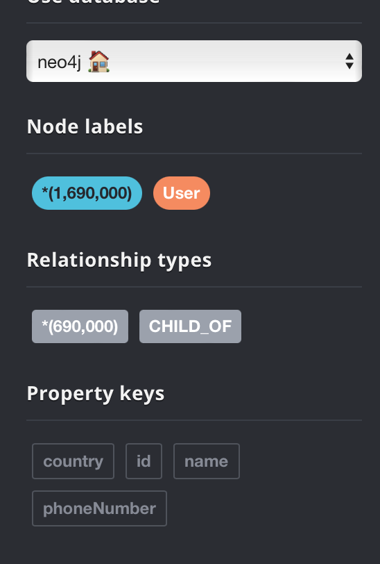
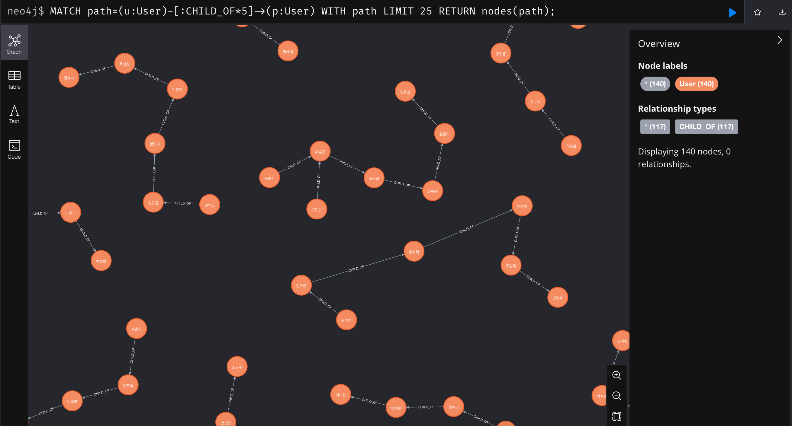

### How Migration From RDB?
1. CSV Export in RDB
2. move csv file into `import` folder at installed neo4j folder (docker in my case)
   3. `docker cp <local csv file path> <container id or name>:<file path>`
4. run query on neo4j
```sql
:auto LOAD CSV WITH HEADERS FROM 'file:///user.csv' AS row
CALL {
  WITH row
  MERGE (u:User {id: toInteger(row.id)})
  ON CREATE SET
    u.name = row.name,
    u.phoneNumber = row.phone_number,
    u.country = row.county
  WITH u, toInteger(row.parent_user_id) AS parentId
  WHERE parentId IS NOT NULL
  MATCH (p:User {id: parentId})
  MERGE (u)-[:CHILD_OF]->(p)
} IN TRANSACTIONS
```

나의 경우에는 약 169만건을 마이그레이션 했는데, 몇가지 시행착오를 예를 들자면
* 어플리케이션에서 양쪽 DB에 조회, 삽입 -> save를 하던 saveAll을 하던 5시간 해도 10만건 들어감
* CSV 파일 Export 후 마이그레이션한 다음 관계 데이터 업데이트 -> OOM, 서버 뻗어버림
```sql
MATCH (u:User)
WHERE u.parentUserId IS NOT NULL 
MATCH (p:User {id: u.parentUserId})
CREATE (u)-[:CHILD_OF]->(p)
```
* id 타입에 인덱스 추가 후 위 쿼리 다시 실행 -> 똑같음.
```sql
CREATE INDEX FOR (u:User) ON (u.id)
```
결국 csv에서 임포트할 때 관계까지 같이 맺어주기로했다. (배치 작업)
<center>

<p>감격</p></center>


